# **lichess-data-warehousing**

### This repo is about data warehouse design, which data source is from lichess open database: https://database.lichess.org/

### I use the 2016 July dataset for this project.

### These images below are my results in hdfs after running the pyspark-etl.py script in hortonwork sandbox:

1. dimGameType
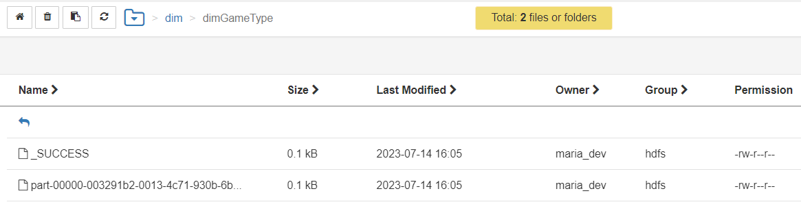
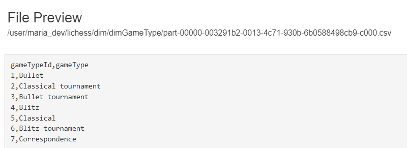

2. dimTermination
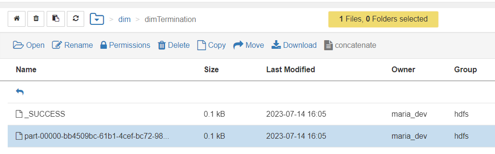
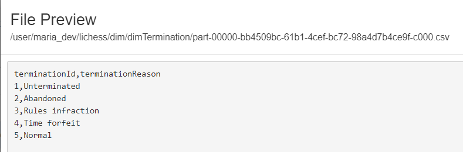

3. dimDate
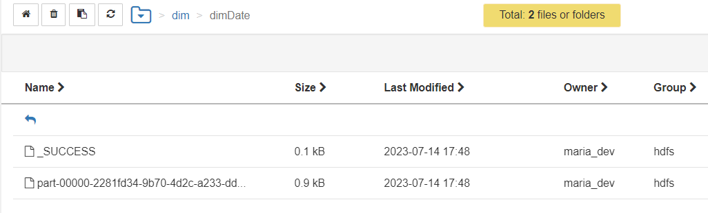
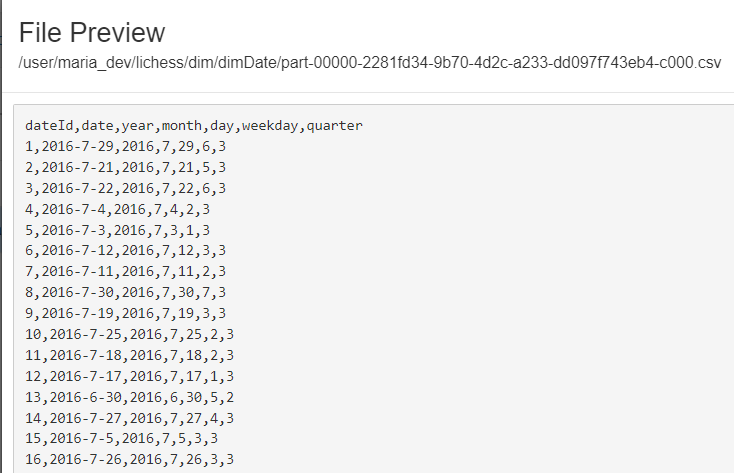

4. dimTime
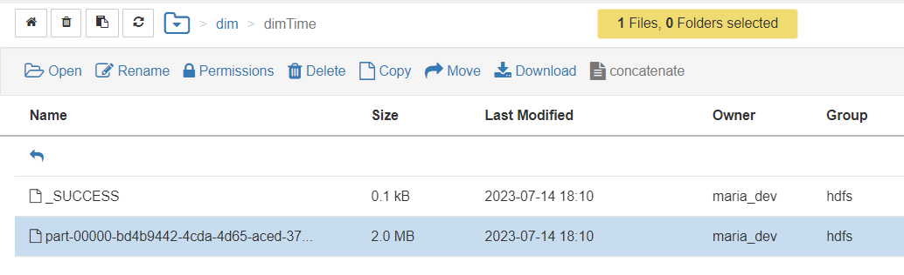
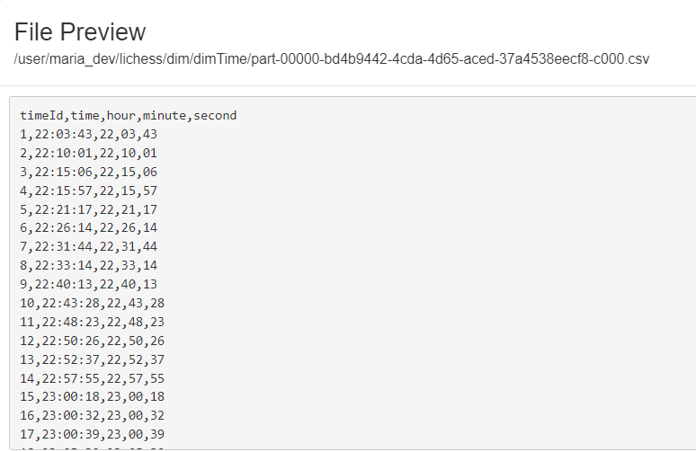

5. dimPlayer
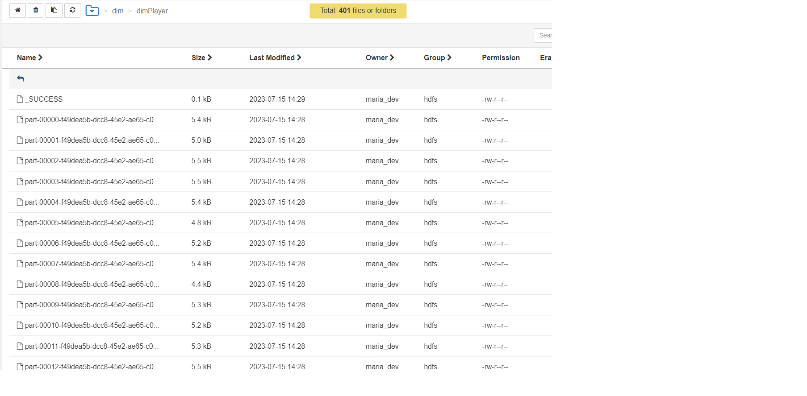
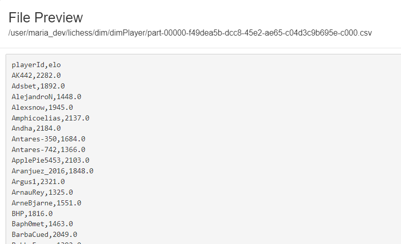

6. factGame
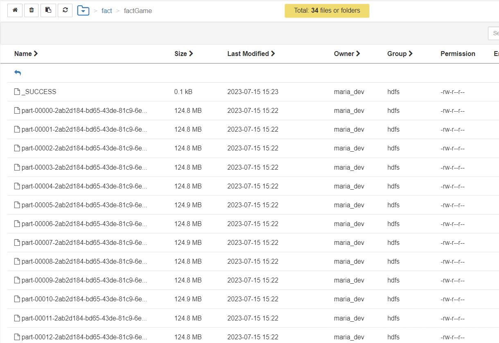
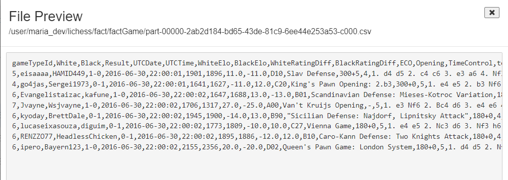